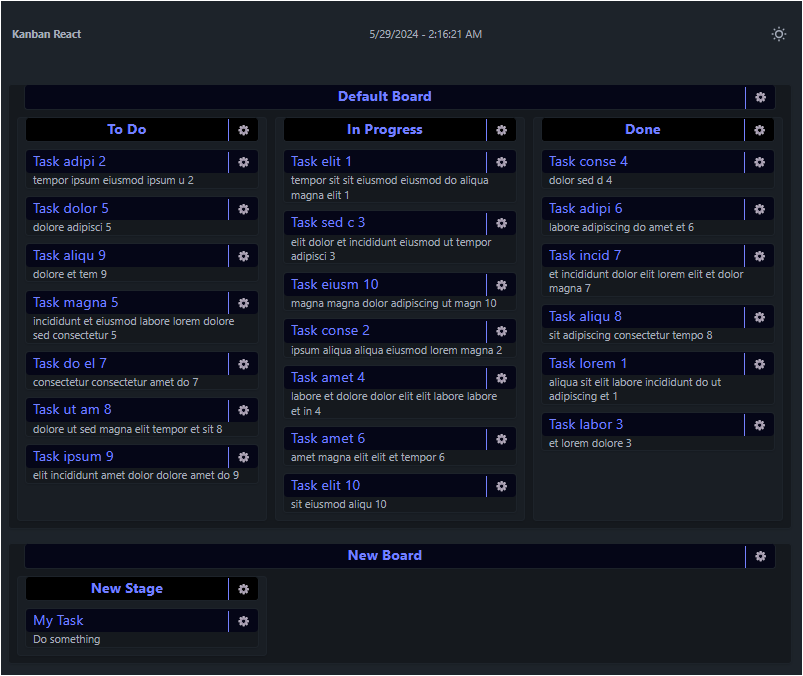

# react-kanban
 trello-like board in react (no database)

 [Try it](https://react-kanban-clod44.netlify.app/)

## features
- [x] Add Boards
- [x] Add & Reorder Stages
- [x] Add & Reorder & Switch Tasks

